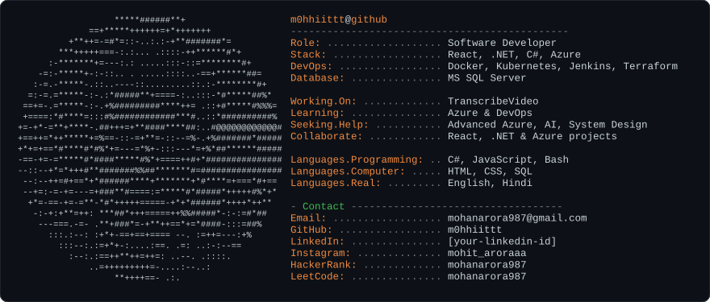

<h1 align="center">Hi 👋, I'm Mohit Arora</h1>
<h3 align="center">A software developer focused on React, .NET, Azure & DevOps</h3>

  

  
  

---

- 🔭 I'm currently working on **TranscribeVideo**
- 🌱 I'm currently learning **Azure & DevOps**
- 🤝 I'm looking for help with **Advanced Azure, AI & System Design**
- 👯 I'm looking to collaborate on **React, .NET & Azure projects**
- 👨‍💻 All of my projects are available at [my portfolio](https://ashy-mushroom-0ac1acd10.2.azurestaticapps.net/)
- 💬 Ask me about **React, .NET, Azure, Docker & Terraform**
- 📫 How to reach me: **mohanarora987@gmail.com**

<h3 align="left">Connect with me:</h3>

<h3 align="left">Languages and Tools:</h3>

  <!-- Languages -->
  

  

  

  

  

  

  <!-- Frameworks -->
  

  

  

  <!-- Cloud & DevOps -->
  

  

  

  

  

  

  <!-- Tools -->
  

